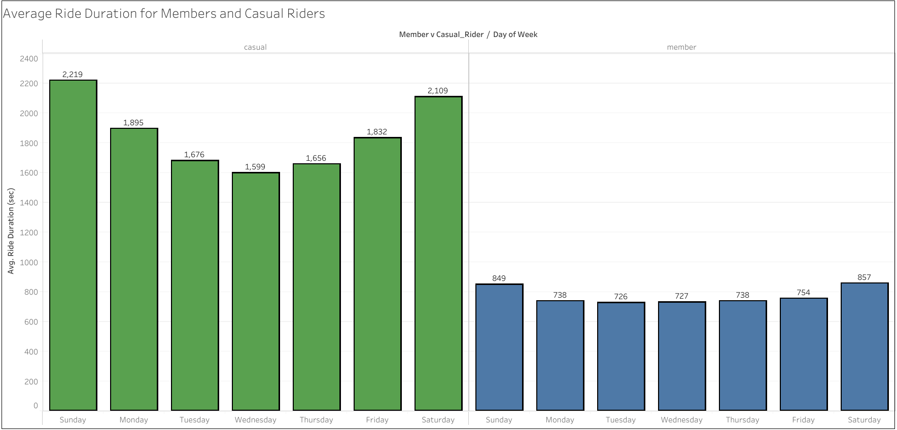

# Google_Data_Analytics_Cert_CaseStudy_Bike-Share-Riders  
### Google Data Analytics Cert Capstone Project 2  
[Case Study 1 - Cyclistic Bike-Share Casual into Annual Members](Images/Case-Study-1.pdf)
---
### Background and Research Question:  
- This is based on Case Study 1 from the Google Data Analytics Certification Capstone. Cyclistic is a fictional bike-share company that has three different kinds of people that rent their bikes: (1) single-ride; (2) full-day; and (3) annual memberships. The company considers single-ride and full-day "casual riders", while annual memberships are "Cyclistic members." The director of marketing for this company wants to design marketing strategies that can convert "casual riders" into annual memberships. The first question to answer, and focus of this report is: **How do annual members and casual riders use Cyclistic bikes differently?**  

This project aims to provide insights and answer the research question by taking two different approaches:  

  - (A) Use **SQL Server** for storage, transformation, cleaning, and basic summaries of the data, then visualize with **Power BI** from a constructed SQL view;  
  
  - (B) Use **R** to handle ETL, summary statistics, some visualizations, and produce a source file for **Tableau** for a final viz.
  
### Statement of Business Task:    
- The business task is to find ways that the casual and member riders differ in how they use the bike-share program. This exploratory analysis will highlight the variations between the two groups of riders, and provide insights from the data to inform the stakeholders (i.e., marketing and executive team at Cyclistic) on areas that could be opportunities. Insights about how the casual riders and members differ may provide gaps that marketing can take advantage of when targeting the casual riders.  

### Description of Data Sources:  
- The data used were provided by Motivate International Inc, and made available publicly as open source data from this website: https://divvy-tripdata.s3.amazonaws.com/index.html  
- The last 12 months of historical trip data were downloaded as individual .csv files for each month between February 2022 to January 2023. These flat files were then then renamed for simplicity and to match convention (e.g., original table named "202202-divvy-tripdata" was renamed as "tripdata_202202") before being imported into a new SQL Server database named "Bike-Share."  

### Documentation of Cleaning and Manipulation of Data:  
	
_SQL Approach_
- Initial review of each of the .csv files within Excel revealed that there was exact matching of column names and order--the only difference from one file to the next were the entries representing each ride recorded for that month. That these data field names and types were matching made it amenable to merging into one data source.
- An initial SQL view was created that appended all the individual months' data into one dataset. This resulted in 5,754,248 rows to start.
- Next, it was confirmed that no duplicates on the unique identifier (ride_id) were present, and that there were no NULLs for other key fields (rideable_type, started_at, ended_at, and member_casual). However, because NULLs were found on end longitude and latitude fields, the view was updated to exclude rows with these incomplete coordinate entries. This final SQL view was named [tripdata_202202_to_202301vw.sql](Data/tripdata_202202_to_202301vw.sql) and has a total of 5,754,121 rows.

_R Approach_ 
- Documentation for each step can also be found in comments in the [Divvy_Script_Bike-Share_R_solutions.R](Divvy_Script_Bike-Share_R_solutions.R) file.  
- The tidyverse and lubridate libraries were used to handle data cleaning and preparation for analyses. More specifically, here are the steps followed in R:
	* one field ("ride_id") had a data type into character transformation;
	* all individual .csv data were stacked into a single dataframe called "all_trips";
	* irrelevant fields (the start and end longitudes and latitudes) were removed;
	* aggregation of data with new columns for the day, month, and year for each ride;
	* new calculated field for "ride_length" or duration as defined as the difference between start/end datetime;
	* removal of data that showed negative ride_lengths, which did not represent true ride durations.

### Summary of Analyses:  
_SQL and Power BI Approach_  
- With available start and end ride times in this dataset, it was possible to derive the total ride time for each rider. A SQL statement to get summary statistics, such as average ride time, and longest/shortest ride times, for bike type and member vs. casual status was executed:  
  
``` sql
SELECT
    rideable_type,
    member_casual,
    AVG(DATEDIFF(minute, started_at, ended_at)) AS avg_ridetime,
    ROUND(STDEV(DATEDIFF(minute, started_at, ended_at)), 2) AS sd_ridetime,
    MIN(DATEDIFF(minute, started_at, ended_at)) AS min_diff_ridetime,
    MAX(DATEDIFF(minute, started_at, ended_at)) AS max_diff_ridetime
FROM [Bike-Share].dbo.tripdata_202202_to_202301
GROUP BY rideable_type, member_casual;  
```  
- Using the SQL view created, Power BI was directed to [tripdata_202202_to_202301vw](Data/tripdata_202202_to_202301vw.sql) to create three visualizations to further investigate casual vs member riders:
    - A doughnut chart to represent the proportion of casual vs. member riders;
    - Stacked column bars to compare the proportion of member and casual riders by bike type;
    - Horizontal stacked bar charts to indicate the Top 10 start and end stations by bike type.  

_R and Tableau Solution_  
- Further analyses in R were executed using the [Divvy Exercise R Script from Google](https://docs.google.com/document/d/1TTj5KNKf4BWvEORGm10oNbpwTRk1hamsWJGj6qRWpuI). A number of steps had to be altered due to the difference in datasets (i.e., current dataset is monthly data, but example in script was for quarterly datasets).
- Descriptive statistics for ride_length were calculated, and two graphs were generated with the ggplot2 library. Finally, data were exported in R as a [local .csv file](Data/avg_ride_length.csv) to be used as a source for Tableau to create a final viz regarding the relationship between ride lengths for casual and member riders.  
### Results, Visualizations, and Recommendations:  
_SQL and Power BI Approach_  
- The SQL described above on ride times of members vs. casual riders by bike type results in the following table:  

| rideable_type	 |  member_casual	  | avg_ridetime |	sd_ridetime	|  min_diff_ridetime	|  max_diff_ridetime  |
| -------------- | ---------------- | -------------| ------------ | ------------------- | ------------------- |
| classic_bike	 | casual			      | 28		       | 90.03		    | -53			            | 1560                |
| docked_bike	   | casual			      | 121		       | 947.76		    | 0			              | 41387               |
| electric_bike	 | casual			      | 16		       | 18.04		    | -138			          | 480                 |
| classic_bike	 | member			      | 13		       | 36.96		    | -169			          | 1560                |
| electric_bike	 | member			      | 11		       | 16.25		    | -10353			        | 614                 |  
	
- Based on these results, the most amount of "ride time" is taken up by docked bikes from casual riders (there were no docked bikes by members).
- Members who use electric bikes tend to have the shortest ride times. Casual riders have longer ride times on average than members, regardless of which bike type they use.  

**How many riders will be the target audience of the advertising or informational campaign?**
- The first graph from Power BI presents the proportion of all Bike-Share rides who are members and casual riders. Although the majority of Bike-Share rides are by members (59%), about 2.3 million rides over the last year were by casual riders, which is the target of our campaign.  
  

**What kinds of bikes do casual riders prefer?** 
- In the second graph, it shows that there is a larger proportion of preference for electric bikes by casual riders than members. For casual riders, about 54% of rides were electric compared to about 49% by members.  
  
  
**Where would we want to reach the most riders?** 
- According to this third graph, the most popular station for starting and ending rides is the Streeter Dr & Grand Ave. station. The majority of bikes at that station remain classic bike rentals, and there are more docked bikes at this location than any other station.
 

### Conclusions and Recommendations based on SQL/Power BI Approach:  
- There were a significant number of casual riders with docked bikes. Therefore, one area of improvement would be an informational campaign to casual riders to decrease the amount of time docked so that more bikes can be available to other riders.
- Another insight is that Casual riders prefer electric bikes more than member riders. If we want more casual riders to become members, perhaps incentives for electric bike rentals can be offered if they join a membership.
- Finally, if we want to maximize where to advertise or connect with riders, we might want to focus the campaign at the top busiest stations (and the Streeter Dr & Grand Ave station should be at highest priority as it is the busiest of them all).  
- - -  
_R and Tableau Approach_  
- In R, the summary function for overall ride_length produced the following table:  

|  Min.  |  1st Qu.  |  Median  |  Mean  |  3rd Qu.  |   Max.   |
| ------ | --------- | -------- | ------ | --------- | -------- |
|   0    |    356    |   626    |  1223  |   1125    |  2483235 |   

- As these values are in seconds, the mean number of minutes for all riders is about 20.35 minutes. The majority of the distribution of rides fell between the first quartile (5.93 minutes) and the third quartile (18.75 minutes).

- Then when the mean, median, max, and min ride_lengths were further broken out by casual vs. member, the following values were provided from R:  

|  ride_length (sec.)  |   Mean    |  Median	 |   Max	   | Min  |
| -------------------- | --------- | --------- | --------- | ---- |
|  casual    	         |  1893.60	 |    809	   |  2483235  |  0   |
|  member    	         |  764.61	 |    532	   |   93594	 |  0   |  

- Casual riders' time biking is more than double at **+ 148%** (mean = 31.56 minutes) than members' ride time (mean = 12.74 minutes).

**What days have the greatest frequency of rides from casual and member riders?**  
- In the first bar graph from R, looking at the number of rides for casual and member riders, it's clear that weekends are more popular than weekdays for casual riders; for members, who likely commute more, their heaviest volume is middle of the work week.
  

**When are casual riders taking the longest rides compared to members?**  
- Average duration of bike rides for casual and member riders, shown in the next graph from R, shows that weekends have longer rides from casual riders. Members, on the other hand, have only slightly longer ride times on weekends than weekdays, suggesting they may be more likely to use the bikes for commutes throughout the week than recreation.
  
	
- This relationship is illustrated a different way within Tableau as a side-by-side comparison of the casual and member ride durations throughout the week, using the final step in the R script (exporting a summary file as a data source).  

     

### Recommendations based on R and Tableau Approach:
- Because casual riders have longer ride durations than members, we may need to further investigate whether shorter rides (thus allowing more bikes to be rented through circulation with more riders) or longer rides (if rented by the minute) would be more profitable.
	* If shorter rides lead to more profitability, perhaps a campaign that encourages casual riders to shorten the distance of their pick up and drop offs would be beneficial. 
	* If longer rides are more profitable, and as our stakeholders want to focus on casual riders for their campaign, then encouraging longer rides during the middle of the week for casual may be able to increase profits (as they tend to only have longer rides on weekends).
- If we are interested in getting more casual riders to subscribe and become members, then it's possible that a marketing campaign that emphasizes the benefits of using Bike-Share for commuting, not just weekend use, might lead to more subscribers.  
- - - 
## Key Takeaways from Analyses
1.  **Casual riders ride more (and longer) on weekends** than mid-week; **members use Bike-Share more during the work week**, suggesting that they are more likely to be commuters than recreational bike riders.  
2.  **Casual riders prefer electric bikes to classic bikes compared members**, who proportionally are more evenly split between bike types.  
3.  **Casual riders have more time with docked bikes than members**. This wasted time while bikes are docked may provide an opportunity for increased revenue.  
